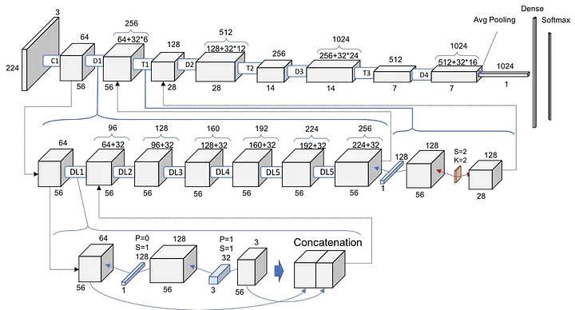

# OCT Retinal Disease Detection


Representative Optical Coherence Tomography (OCT) scan of the retina used for deep learning–based retinal disease classification.

## Table of Contents

1. Overview
2. Model Architecture
3. Training Details
4. Dataset Information
5. Model Performance
6. Model Input and Output
7. Model Limitations
8. Model Versioning
9. Dependencies
10. License
11. Usage Guidelines
12. Additional Notes

## Model Architecture

### Fine-Tuned DenseNet-121 Architecture



All feature extraction layers were frozen, and only the classification head was replaced and fine-tuned for binary classification.

## Model Input and Output

### 1. Description of the Input Features

Inputs are Optical Coherence Tomography (OCT) images of retinal tissues containing structural and morphological retinal features. The model expects three-channel images of size 224 × 224 pixels for feature extraction and classification tasks. Images are converted into PyTorch tensors with dimensions `(batch_size, 3, 224, 224)` before being passed to the network.

### 2. Description and Interpretation of the Model Output

The final layer of the model produces raw prediction scores called logits. These logits are converted into probabilities using the Softmax activation function. Since the model performs binary classification, the output tensor has shape `[batch_size, 2]`.

Example logits:

```python
tensor([[-0.9759, 0.7543]])
```

After applying Softmax:

```python
tensor([[0.1506, 0.8494]])
```

The resulting values represent the model's confidence for each class. In this example, the model predicts the second class with 84.94% confidence. The sum of both probabilities equals 100%.

## Dependencies

### Software Requirements

- numpy 1.26.0
- torch 2.1.0
- torchvision 0.16.0
- pillow 10.0.1
- pandas 2.1.1
- streamlit 1.28.1

### Hardware Requirements

- Recommended: GPU

## License

MIT License

## Additional Notes

- The model was developed using PyTorch and Python in a GPU-enabled environment.
- The architecture is based on a DenseNet-121 backbone pre-trained on ImageNet and adapted for retinal disease classification.
- Training and validation were performed on a large OCT image dataset containing over 100,000 retinal scans.
- Hyperparameter tuning and experimentation were conducted using multiple pre-trained architectures, including ResNet, VGG, and DenseNet variants.
- Class imbalance was addressed through weighted loss functions during training.
- Future improvements may include multi-class disease classification, explainable AI techniques, localization methods, and ensemble learning approaches.
