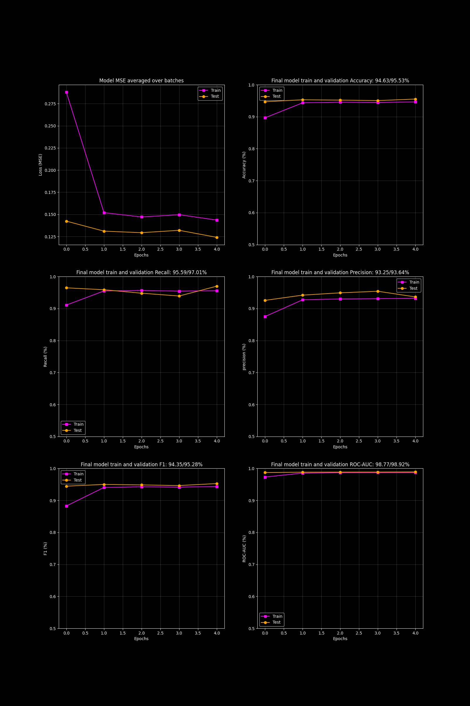

# OCT Retinal Disease Detection


Representative Optical Coherence Tomography (OCT) scan of the retina used for deep learning–based retinal disease classification.

## Table of Contents

1. Overview
2. Model Architecture
3. Training Details
4. Dataset Information
5. Model Performance
6. Model Input and Output
7. Model Limitations
8. Model Versioning
9. Dependencies
10. License
11. Usage Guidelines
12. Additional Notes

---

## Overview

This project aims to develop a deep learning model for the detection of retinal diseases from Optical Coherence Tomography (OCT) images. Optical Coherence Tomography is a non-invasive imaging technique used for high-resolution cross-sectional imaging of the retina. Early detection of retinal diseases such as age-related macular degeneration, diabetic retinopathy, and glaucoma is crucial for timely intervention and treatment.

The project utilizes pre-trained deep neural networks and transfer learning to create an accurate and robust retinal disease detection system. The DenseNet121 model, originally trained on the ImageNet dataset, serves as a powerful starting point for medical image classification tasks.

### Key Advantages of Transfer Learning

1. **Time and Resource Savings**
2. **Feature Extraction Capability**
3. **Generalization Power**
4. **Fine-Tuning Flexibility**
5. **Overcoming Data Limitations**

---

## Model Architecture

### Fine-Tuned DenseNet-121 Architecture


All feature extraction layers were frozen, and only the classification head was replaced and fine-tuned for binary classification.

---

## Training Details

### Dataset

#### Training Set (98,648 images)
- ABNORMAL: 52,269 images
- NORMAL: 46,379 images

#### Validation Set (5,194 images)
- ABNORMAL: 2,753 images
- NORMAL: 2,441 images

#### Test Set (5,467 images)
- ABNORMAL: 2,897 images
- NORMAL: 2,570 images

### Data Preprocessing Steps

- Grayscale to RGB conversion
- Resize to 256 using Bilinear interpolation
- Center Crop (224)
- Convert to PyTorch Tensors
- Normalize using:
  - Mean: `[0.485, 0.456, 0.406]`
  - Standard Deviation: `[0.229, 0.224, 0.225]`

### Hyperparameters Used During Training

| Parameter | Value |
|------------|--------|
| Train Batch Size | 512 |
| Validation Batch Size | 256 |
| Test Batch Size | 256 |
| Input Image Size | (3, 224, 224) |
| Learning Rate | 0.01 |
| Weight Decay | 1e-3 |
| Class Weights | 0.9436568520537986 (ABNORMAL), 1.0634985661614094 (NORMAL) |
| Optimizer | Adam |
| Loss Function | Weighted Cross-Entropy Loss (wCE) |
| Training Epochs | 5 (193 training batches) |
| Output Units | 2 |
| Layer Freezing | All feature extraction layers frozen |

---

## Dataset Information

### Large Dataset of Labeled Optical Coherence Tomography (OCT)

This dataset contains thousands of validated OCT scans described in:

> *Identifying Medical Diagnoses and Treatable Diseases by Image-Based Deep Learning*

The images are categorized into:

- CNV
- DME
- DRUSEN
- NORMAL

For binary classification:

- CNV + DME + DRUSEN → ABNORMAL
- NORMAL → NORMAL

### Data Source and Collection Methods

Dataset contributors:

- Daniel Kermany
- Kang Zhang
- Michael Goldbaum

Source:

https://data.mendeley.com/datasets/rscbjbr9sj/3

### Original Dataset Statistics

| Medical Condition | Feature | Number of Samples (Train, Test) |
|------------------|---------|----------------------------------|
| Choroidal Neovascularization | CNV | (37,205, 250) |
| Diabetic Macular Edema | DME | (11,348, 250) |
| Drusen | DRUSEN | (8,616, 250) |
| Healthy | NORMAL | (51,140, 250) |

### Dataset Statistics After Binary Restructuring

| Medical Condition | Feature | Number of Samples | Absolute Split Percentage | Class Imbalance |
|------------------|---------|-------------------|---------------------------|----------------|
| ABNORMAL | CNV | 52,269 / 2,753 / 2,897 | 90.25% / 4.75% / 5.00% | 1.13 / 1.13 / 1.13 |
| NORMAL | NORMAL | 46,379 / 2,441 / 2,570 | 90.25% / 4.75% / 5.00% | 1 / 1 / 1 |

Weighted loss function was used to address class imbalance during training.

---

## Model Performance



### Performance Metrics

| Metric | Training Set | Validation Set | Test Set |
|----------|------------|------------|---------|
| Accuracy | 94.63% | 95.53% | 95.37% |
| Recall | 95.59% | 97.01% | 96.67% |
| Precision | 93.25% | 93.64% | 93.67% |
| F1 Score | 94.35% | 95.28% | 95.12% |
| ROC-AUC | 98.77% | 98.92% | 98.75% |

### Key Observations

- Consistent performance across training, validation, and test sets.
- High precision and recall indicate effective disease detection.
- ROC-AUC values above 98% demonstrate strong class discrimination.

---

## Model Input and Output

### 1. Description of the Input Features

Inputs are Optical Coherence Tomography (OCT) images of retinal tissues containing structural and morphological retinal features. The model expects three-channel images of size 224 × 224 pixels for feature extraction and classification tasks. Images are converted into PyTorch tensors with dimensions `(batch_size, 3, 224, 224)` before being passed to the network.

### 2. Description and Interpretation of the Model Output

Example logits:

```python
tensor([[-0.9759, 0.7543]])
```

After applying Softmax:

```python
tensor([[0.1506, 0.8494]])
```

The resulting values represent the model's confidence for each class. In this example, the model predicts the second class with 84.94% confidence.

---

## Dependencies

### Software Requirements

- numpy 1.26.0
- torch 2.1.0
- torchvision 0.16.0
- pillow 10.0.1
- pandas 2.1.1
- streamlit 1.28.1

### Hardware Requirements

- Recommended: GPU

---

## License

MIT License

---

## Additional Notes

- The model was developed using PyTorch and Python in a GPU-enabled environment.
- The architecture is based on a DenseNet-121 backbone pre-trained on ImageNet.
- Training and validation were performed on a large OCT image dataset containing over 100,000 retinal scans.
- Hyperparameter tuning was conducted using multiple architectures, including ResNet, VGG, and DenseNet variants.
- Class imbalance was addressed through weighted loss functions.
- Future improvements may include multi-class classification, explainable AI, localization techniques, and ensemble learning approaches.
